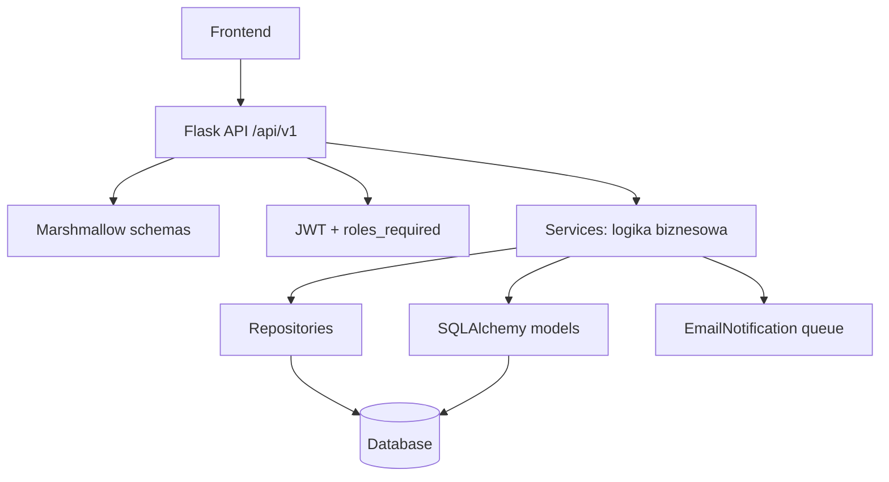
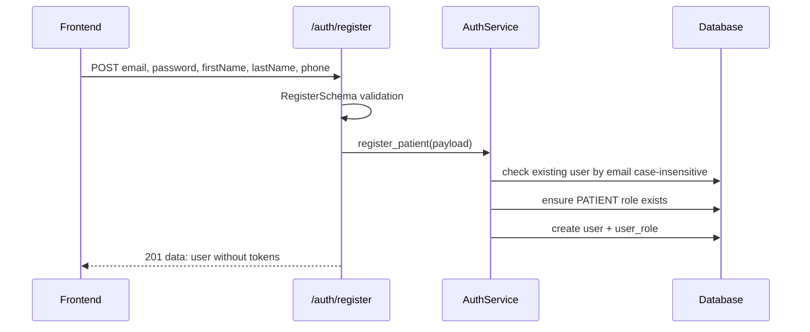
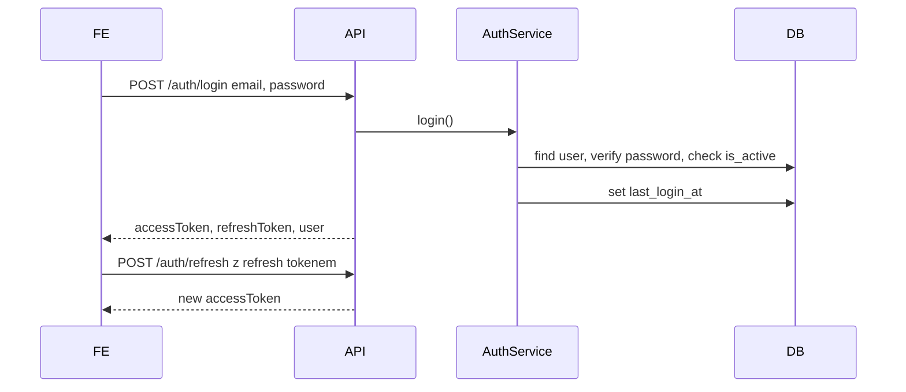
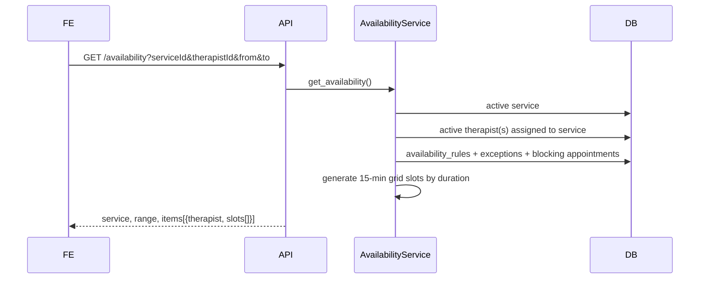
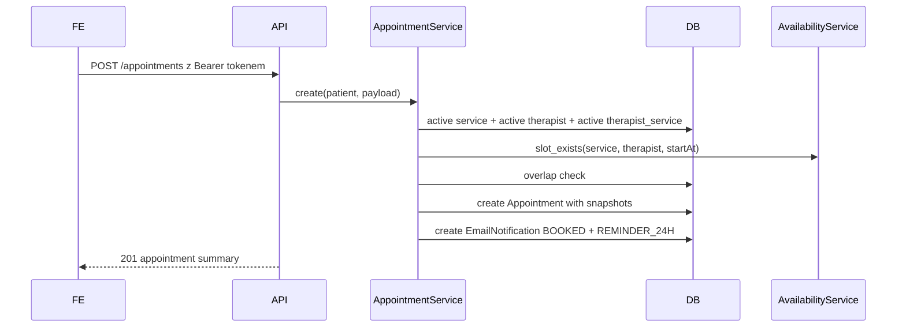
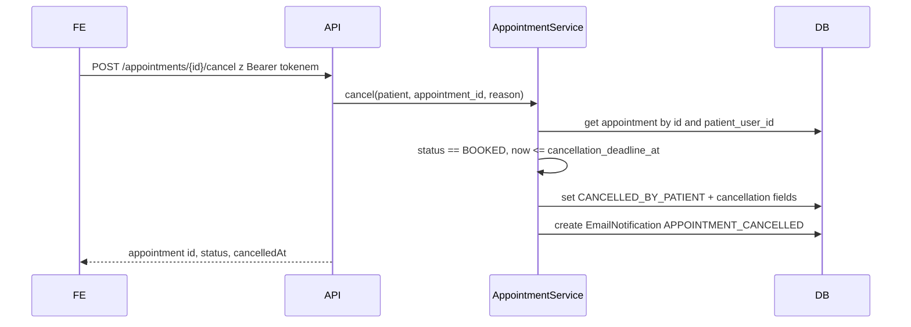
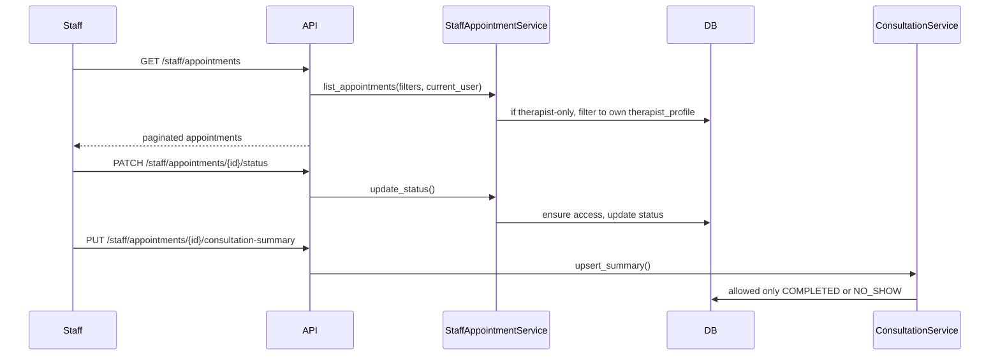
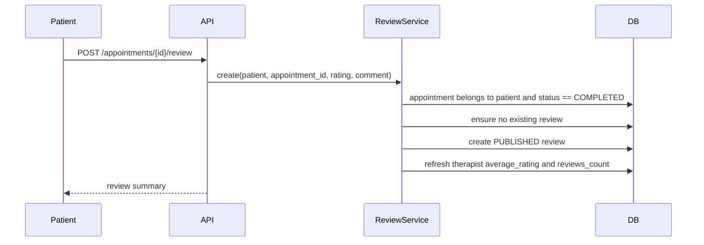

# Backend aplikacji rezerwacji konsultacji — dokumentacja dla developerów

**Cel dokumentu:** to jest jedno, spójne źródło informacji o backendzie na bazie plików z projektu. Dokument ma pozwolić zrozumieć działanie aplikacji, kontrakt API, przepływy danych, integrację z frontendem, zasady biznesowe oraz sposoby weryfikacji bez konieczności czytania kodu.

**Zakres:** backend Flask z REST API pod prefiksem `/api/v1`, autoryzacją JWT, bazą SQLAlchemy, seedem danych demonstracyjnych, testami pytest oraz prostym mechanizmem kolejkowania powiadomień email w bazie.

---

## 1. Szybki obraz systemu

Aplikacja obsługuje rezerwację wizyt u terapeutów. Główne funkcje:

- rejestracja i logowanie pacjenta,
- publiczny katalog usług i terapeutów,
- wyliczanie dostępnych terminów wizyt,
- rezerwacja i anulowanie wizyty przez pacjenta,
- panel staff/admin do zarządzania wizytami, opisami konsultacji, usługami, terapeutami i grafikiem,
- opinie pacjentów po zakończonych wizytach,
- zapisywanie zaplanowanych powiadomień email w tabeli `email_notifications`.

Główne role użytkowników:

| Rola | Znaczenie |
|---|---|
| `PATIENT` | pacjent; może rezerwować, przeglądać i anulować własne wizyty, dodawać opinie po zakończonej wizycie |
| `THERAPIST` | terapeuta; może widzieć przypisane do siebie wizyty, zmieniać ich status i dodawać opis konsultacji |
| `ADMIN` | administrator; ma dostęp do endpointów admina oraz staff, może zarządzać usługami, terapeutami i grafikami |

---

## 2. Stack technologiczny

Backend jest aplikacją Flask.

Najważniejsze zależności z `requirements.txt`:

- `Flask` — framework HTTP,
- `Flask-SQLAlchemy` / `SQLAlchemy` — ORM i baza danych,
- `Flask-Migrate` / `alembic` — migracje, chociaż w paczce brak gotowych plików migracji,
- `Flask-JWT-Extended` — access i refresh tokeny JWT,
- `flask-cors` — CORS dla frontendu,
- `marshmallow` / `marshmallow-sqlalchemy` — walidacja wejścia i serializacja,
- `pytest`, `pytest-flask` — testy.

Baza domyślna lokalnie: SQLite przez `sqlite:///app.db`. W Dockerze używany jest PostgreSQL przez `DATABASE_URL`, a zależności zawierają `psycopg2-binary`.

---

## 3. Struktura projektu

```text
backend/
├── app/
│   ├── __init__.py                    # factory create_app, konfiguracja rozszerzeń, błędy globalne, rejestracja blueprintów
│   ├── config.py                      # konfiguracja envów: development/testing/production
│   ├── extensions.py                  # db, migrate, jwt, cors
│   ├── wsgi.py                        # entrypoint WSGI
│   ├── seed_data.py                   # pełny seed demo używany przy starcie run.py i w testach
│   ├── celery_app.py                  # wygląda na nieużywany / niedokończony moduł Celery
│   ├── api/                           # warstwa HTTP: blueprinty i endpointy
│   ├── schemas/                       # Marshmallow: walidacja requestów i serializacja response
│   ├── services/                      # logika biznesowa
│   ├── repositories/                  # zapytania DB i pomocnicza warstwa dostępu do danych
│   ├── models/                        # modele SQLAlchemy
│   ├── utils/                         # auth, błędy, enumy, daty, paginacja
│   └── cli/                           # komendy Flask CLI: seed i reminders
├── tests/                             # testy integracyjne API
├── requirements.txt
└── run.py                             # lokalny start: create_all + seed_database + app.run(debug=True)
```

Najważniejszy entrypoint aplikacji to `app.create_app()`. Wszystkie aktywne blueprinty są rejestrowane w `app/api/__init__.py`.

---

## 4. Konfiguracja środowiska

Konfiguracja znajduje się w `app/config.py`.

| Zmienna | Domyślna wartość | Znaczenie |
|---|---:|---|
| `FLASK_ENV` | `development` | wybór konfiguracji: `development`, `testing`, `production` |
| `SECRET_KEY` | `dev-secret` | sekret Flask |
| `JWT_SECRET_KEY` | `dev-jwt-secret` | sekret podpisu JWT |
| `DATABASE_URL` | `sqlite:///app.db` | baza dla development/production |
| `TEST_DATABASE_URL` | `sqlite:///:memory:` | baza dla testów |
| `CORS_ORIGINS` | `http://localhost:3000` | lista originów po przecinku |
| `APP_TIMEZONE` | `Europe/Warsaw` | strefa używana do budowy lokalnych okien dostępności |
| `MAIL_SENDER` | `noreply@example.com` | obecnie prawie nieużywane, przygotowane pod email |
| `MAIL_BACKEND` | `console` | `console` wypisuje maile do stdout; `smtp` wysyła przez zmienne `MAIL_SMTP_*` |

Czasy życia tokenów:

| Konfiguracja | Access token | Refresh token |
|---|---:|---:|
| development/production | 30 minut | 7 dni |
| testing | 5 minut | 30 minut |

CORS jest włączony dla ścieżek `/api/*`, z `supports_credentials=True`.

---

## 5. Uruchamianie Docker

Pełne uruchomienie systemu kontenerowego opisuje `docs/docker.md`. Skrót:

```bash
cp .env.example .env
docker compose up --build
```

Po starcie backend odpowiada pod `http://localhost:8080/api/v1/health`, a frontend pod `http://localhost:3000`.

## 6. Uruchamianie lokalne

Przykładowy start lokalny:

```bash
cd backend
python -m venv .venv
source .venv/bin/activate
pip install -r requirements.txt
python run.py
```

`run.py` wykonuje:

1. `create_app()`,
2. `db.create_all()`,
3. `seed_database()`,
4. `app.run(debug=True)`.

Oznacza to, że przy lokalnym uruchomieniu tabele są tworzone automatycznie, a dane demonstracyjne są dosiewane. Seed jest napisany częściowo idempotentnie — większość rekordów jest tworzona tylko wtedy, gdy jeszcze nie istnieje.

Alternatywnie, dla WSGI:

```bash
flask --app app run
```

Komendy CLI:

```bash
flask --app app seed
flask --app app reminders send-due
```

`seed` tworzy podstawowe role i dwie usługi demo. Pełniejszy seed danych demonstracyjnych jest w `app/seed_data.py` i jest wywoływany przez `run.py` oraz fixture testową.

---

## 6. Dane demonstracyjne

`seed_data.py` tworzy role, użytkowników, terapeutów, usługi, powiązania terapeuta-usługa, reguły dostępności, przykładowe wizyty, opis konsultacji, opinię i powiadomienia.

Konta demo:

| Rola | Email | Hasło |
|---|---|---|
| Admin | `admin@example.com` | `Admin123!` |
| Terapeuta | `anna@example.com` | `Password123!` |
| Terapeuta | `piotr@example.com` | `Password123!` |
| Pacjent | `jan@example.com` | `Password123!` |
| Pacjent | `ola@example.com` | `Password123!` |

Usługi demo:

| Kod | Nazwa | Czas | Cena bazowa |
|---|---|---:|---:|
| `CONSULT_50` | Konsultacja psychologiczna | 50 min | 180 PLN |
| `THERAPY_50` | Sesja terapeutyczna | 50 min | 200 PLN |

Terapeuci demo:

| Terapeuta | Tytuł | Usługi |
|---|---|---|
| Anna Nowak | Psycholog | `CONSULT_50`, `THERAPY_50` |
| Piotr Kowalczyk | Psychoterapeuta | `THERAPY_50` |

Przykładowe grafiki:

| Terapeuta | Dni tygodnia ISO | Godziny |
|---|---|---|
| Anna | 1, 3 | poniedziałek 09:00-15:00, środa 10:00-18:00 |
| Piotr | 2, 4 | wtorek 08:00-14:00, czwartek 12:00-19:00 |

W systemie ISO weekday: `1 = poniedziałek`, ..., `7 = niedziela`.

---

## 7. Architektura aplikacji

### 7.1. Warstwy



Typowy request:

1. Frontend wysyła JSON albo query params.
2. Route pobiera dane z `request.get_json()` lub `request.args`.
3. `load_or_400(schema, payload)` waliduje wejście Marshmallow.
4. Endpoint pobiera użytkownika przez JWT, jeśli endpoint wymaga autoryzacji.
5. Serwis wykonuje logikę biznesową i zapisuje/odczytuje DB.
6. Endpoint zwraca `success(data, meta?, status?)`.

### 7.2. Konwencja odpowiedzi sukcesu

Każdy aktywny endpoint API zwraca JSON w postaci:

```json
{
  "data": {}
}
```

Dla list stronicowanych:

```json
{
  "data": [],
  "meta": {
    "page": 1,
    "pageSize": 10,
    "total": 123
  }
}
```

### 7.3. Konwencja błędów

Błędy aplikacyjne dziedziczą po `AppError` i są mapowane globalnie do:

```json
{
  "error": {
    "code": "VALIDATION_ERROR",
    "message": "Nieprawidłowe dane wejściowe.",
    "details": {}
  }
}
```

`details` pojawia się tylko, gdy błąd je ustawia.

Globalne handlery:

| Sytuacja | HTTP | `error.code` |
|---|---:|---|
| brak JWT | 401 | `UNAUTHORIZED` |
| nieprawidłowy JWT | 401 | `UNAUTHORIZED` |
| wygasły JWT | 401 | `TOKEN_EXPIRED` |
| brak zasobu/route | 404 | `NOT_FOUND` |
| zła metoda HTTP | 405 | `METHOD_NOT_ALLOWED` |
| nieobsłużony wyjątek | 500 | `INTERNAL_SERVER_ERROR` |

Klasy błędów domenowych:

| Klasa | HTTP | Domyślny kod |
|---|---:|---|
| `ValidationError` | 400 | `VALIDATION_ERROR` |
| `UnauthorizedError` | 401 | `UNAUTHORIZED` |
| `ForbiddenError` | 403 | `FORBIDDEN` |
| `NotFoundError` | 404 | `NOT_FOUND` |
| `ConflictError` | 409 | `CONFLICT` |

---

## 8. Autoryzacja i role

Autoryzacja opiera się na Bearer JWT:

```http
Authorization: Bearer <accessToken>
```

Endpointy, które wymagają zalogowania, mają dekorator `@jwt_required()`. Endpointy rolowe mają dodatkowo `@roles_required(...)`.

`roles_required` działa na zasadzie przecięcia ról: użytkownik przechodzi warunek, jeśli ma co najmniej jedną wymaganą rolę. Przykład: endpoint staff z `roles_required("ADMIN", "THERAPIST")` jest dostępny dla admina albo terapeuty.

Ważne zachowania:

- `POST /auth/logout` nie unieważnia JWT po stronie serwera. Zwraca komunikat, że wylogowanie odbywa się po stronie klienta.
- Brak blacklisty tokenów.
- `refresh` wymaga refresh tokenu, nie access tokenu.
- Role użytkownika są zwracane w `user.roles` jako lista stringów.

---

## 9. Model danych

### 9.1. Encje

Wszystkie główne modele używają UUID string `id` i timestampów `created_at`, `updated_at`, jeśli dziedziczą po `UUIDPrimaryKeyMixin` i `TimestampMixin`.

#### `users`

| Pole | Typ / znaczenie |
|---|---|
| `id` | UUID string |
| `email` | unikalny, indeksowany |
| `password_hash` | hash hasła Werkzeug `pbkdf2:sha256` |
| `first_name`, `last_name` | dane osobowe |
| `phone` | opcjonalny telefon |
| `is_active` | blokada konta |
| `is_email_verified` | flaga weryfikacji email, obecnie bez flow weryfikacji |
| `last_login_at` | ustawiane przy loginie |

Relacje: role przez `user_roles`, profil terapeuty jeden-do-jednego, wizyty pacjenta.

#### `roles` i `user_roles`

`roles.name` przyjmuje wartości `PATIENT`, `THERAPIST`, `ADMIN`. `user_roles` jest tabelą łącznikową z unikalnością `(user_id, role_id)`.

#### `services`

| Pole | Znaczenie |
|---|---|
| `code` | unikalny kod usługi, np. `CONSULT_50` |
| `name`, `description` | opis usługi |
| `duration_minutes` | czas trwania, walidowany na 15-240 min przy admin create/update |
| `base_price` | cena bazowa |
| `currency` | domyślnie `PLN` |
| `is_active` | tylko aktywne usługi są publicznie dostępne i rezerwowalne |

#### `therapist_profiles`

Profil terapeuty jest powiązany z użytkownikiem przez `user_id`.

| Pole | Znaczenie |
|---|---|
| `title` | tytuł/specjalizacja |
| `bio` | opis |
| `experience_years` | opcjonalne doświadczenie |
| `photo_url` | opcjonalny URL zdjęcia |
| `is_active` | tylko aktywni terapeuci są publicznie dostępni |
| `average_rating`, `reviews_count` | denormalizowane statystyki opinii |

#### `therapist_services`

Łączy terapeutę z usługą.

| Pole | Znaczenie |
|---|---|
| `therapist_id`, `service_id` | unikalna para |
| `is_active` | tylko aktywne połączenie umożliwia wyświetlenie i rezerwację |
| `price_override` | cena terapeuty dla usługi, jeśli inna niż bazowa |
| `duration_override_minutes` | czas wizyty terapeuty dla usługi, jeśli inny niż bazowy |

#### `availability_rules`

Cykliczne reguły pracy terapeuty.

| Pole | Znaczenie |
|---|---|
| `therapist_id` | terapeuta |
| `weekday` | dzień tygodnia ISO `1-7` |
| `start_time`, `end_time` | lokalne godziny pracy |
| `valid_from`, `valid_to` | zakres dat obowiązywania |
| `is_active` | aktywność reguły |

#### `availability_exceptions`

Wyjątki od grafiku.

| Pole | Znaczenie |
|---|---|
| `type` | `UNAVAILABLE` albo `EXTRA_AVAILABLE` |
| `start_at`, `end_at` | zakres daty/czasu |
| `reason` | opcjonalny powód |

Obecnie algorytm dostępności uwzględnia tylko `UNAVAILABLE` jako blokadę. `EXTRA_AVAILABLE` jest walidowane i zapisywane, ale nie generuje dodatkowych slotów poza regułami pracy.

#### `appointments`

Najważniejsza encja rezerwacji.

| Pole | Znaczenie |
|---|---|
| `patient_user_id` | pacjent |
| `therapist_id` | terapeuta |
| `service_id` | usługa |
| `start_at`, `end_at` | czas wizyty |
| `status` | status wizyty |
| `booked_at` | czas utworzenia rezerwacji |
| `cancellation_deadline_at` | deadline anulowania przez pacjenta, `start_at - 24h` |
| `cancelled_at`, `cancelled_by_user_id`, `cancellation_reason` | dane anulowania |
| `*_snapshot` | snapshot nazwy/opisu/ceny/czasu usługi oraz danych terapeuty w momencie rezerwacji |

Statusy wizyty:

- `BOOKED`,
- `CANCELLED_BY_PATIENT`,
- `CANCELLED_BY_CLINIC`,
- `COMPLETED`,
- `NO_SHOW`.

Snapshoty są ważne dla frontendu i historii: zmiana ceny, nazwy usługi albo tytułu terapeuty nie zmienia danych już utworzonej wizyty.

#### `consultation_summaries`

Jeden opis konsultacji na wizytę. Może zostać dodany lub nadpisany przez staff/admin dla wizyty zakończonej statusem `COMPLETED` albo `NO_SHOW`.

#### `reviews`

Jedna opinia na wizytę. Opinie są publicznie listowane tylko ze statusem `PUBLISHED`. Utworzenie opinii odświeża `average_rating` i `reviews_count` terapeuty.

#### `email_notifications`

Prosta tabela kolejki powiadomień.

| Pole | Znaczenie |
|---|---|
| `appointment_id` | opcjonalne powiązanie z wizytą |
| `recipient_email` | adres odbiorcy |
| `type` | `APPOINTMENT_BOOKED`, `APPOINTMENT_CANCELLED`, `APPOINTMENT_REMINDER_24H` |
| `status` | `PENDING`, `SENT`, `FAILED` |
| `scheduled_at` | kiedy można wysłać |
| `sent_at` | kiedy wysłano |
| `error_message` | błąd wysyłki |

---

## 10. Data-flow najważniejszych procesów

### 10.1. Rejestracja pacjenta



Po rejestracji użytkownik nie jest automatycznie logowany — frontend powinien albo przekierować do logowania, albo wywołać login osobno.

### 10.2. Logowanie i refresh



Frontend powinien przechowywać oba tokeny zgodnie z własnym modelem bezpieczeństwa. Backend nie ustawia cookies samodzielnie.

### 10.3. Wyszukanie dostępności



Algorytm:

1. Usługa musi być aktywna.
2. Jeśli podano `therapistId`, terapeuta musi istnieć i być aktywny.
3. Jeśli nie podano `therapistId`, system bierze wszystkich aktywnych terapeutów przypisanych do usługi.
4. Dla każdego terapeuty pobiera aktywne reguły grafiku, wyjątki i blokujące wizyty.
5. Dla każdego dnia w zakresie wybiera reguły o pasującym `weekday`, `valid_from`, `valid_to`.
6. Tworzy sloty co 15 minut (`SLOT_MINUTES = 15`).
7. Czas trwania slotu to `duration_override_minutes` z `therapist_services`, a jeśli go nie ma — `services.duration_minutes`.
8. Slot jest odrzucany, jeśli nakłada się na wyjątek `UNAVAILABLE` albo wizytę o statusie `BOOKED`, `COMPLETED`, `NO_SHOW`.

Frontend powinien traktować `slot.startAt` zwrócony przez API jako jedyny poprawny timestamp do rezerwacji.

### 10.4. Rezerwacja wizyty



Warunki biznesowe:

- użytkownik musi być zalogowany,
- `startAt` musi być w przyszłości,
- terapeuta musi realizować usługę,
- slot musi istnieć w aktualnie wyliczonej dostępności,
- nie może istnieć nakładająca się wizyta dla terapeuty w statusie `BOOKED`, `COMPLETED` albo `NO_SHOW`,
- deadline anulowania jest ustawiany na 24 godziny przed startem.

### 10.5. Anulowanie wizyty przez pacjenta



Pacjent nie może anulować:

- cudzej wizyty,
- wizyty nieistniejącej,
- wizyty w statusie innym niż `BOOKED`,
- wizyty później niż 24 godziny przed startem.

### 10.6. Obsługa wizyty przez staff/terapeutę



Admin widzi wizyty zgodnie z filtrami. Terapeuta bez roli admina widzi tylko wizyty powiązane z własnym profilem terapeuty.

### 10.7. Opinie



Opinia jest możliwa tylko dla zakończonej wizyty (`COMPLETED`) i tylko raz na wizytę.

---

## 11. Kontrakt API

Bazowy prefiks aktywnego API: `/api/v1`.

### 11.1. Health

#### `GET /api/v1/health`

Publiczny endpoint sprawdzający, czy API działa.

Response `200`:

```json
{
  "data": {
    "status": "ok"
  }
}
```

---

### 11.2. Auth i użytkownik

#### `POST /api/v1/auth/register`

Tworzy pacjenta z rolą `PATIENT`.

Auth: brak.

Body:

```json
{
  "email": "new.patient@example.com",
  "password": "Password123!",
  "firstName": "Nowy",
  "lastName": "Pacjent",
  "phone": "+48123123123"
}
```

Walidacja:

| Pole | Wymagane | Zasady |
|---|---:|---|
| `email` | tak | poprawny email |
| `password` | tak | długość 8-128 |
| `firstName` | tak | długość 2-100 |
| `lastName` | tak | długość 2-100 |
| `phone` | nie | string |

Response `201`:

```json
{
  "data": {
    "id": "uuid",
    "email": "new.patient@example.com",
    "firstName": "Nowy",
    "lastName": "Pacjent",
    "roles": ["PATIENT"]
  }
}
```

Błędy domenowe:

- `409 USER_ALREADY_EXISTS` — email już istnieje.

#### `POST /api/v1/auth/login`

Loguje użytkownika.

Auth: brak.

Body:

```json
{
  "email": "jan@example.com",
  "password": "Password123!"
}
```

Response `200`:

```json
{
  "data": {
    "accessToken": "jwt",
    "refreshToken": "jwt",
    "user": {
      "id": "uuid",
      "email": "jan@example.com",
      "firstName": "Jan",
      "lastName": "Kowalski",
      "roles": ["PATIENT"]
    }
  }
}
```

Błędy:

- `401 AUTH_INVALID_CREDENTIALS`,
- `401 USER_INACTIVE`.

#### `POST /api/v1/auth/refresh`

Wydaje nowy access token.

Auth: wymagany refresh token w `Authorization: Bearer ...`.

Response `200`:

```json
{
  "data": {
    "accessToken": "new-jwt"
  }
}
```

#### `POST /api/v1/auth/logout`

Zwraca komunikat o wylogowaniu po stronie klienta. Nie unieważnia tokenów w bazie.

Auth: access token.

Response `200`:

```json
{
  "data": {
    "message": "Użytkownik jan@example.com został wylogowany po stronie klienta."
  }
}
```

#### `GET /api/v1/users/me`

Zwraca aktualnego użytkownika.

Auth: access token.

Response `200`:

```json
{
  "data": {
    "id": "uuid",
    "email": "jan@example.com",
    "firstName": "Jan",
    "lastName": "Kowalski",
    "roles": ["PATIENT"]
  }
}
```

---

### 11.3. Publiczny katalog usług

#### `GET /api/v1/services`

Zwraca aktywne usługi posortowane po nazwie.

Auth: brak.

Response `200`:

```json
{
  "data": [
    {
      "id": "uuid",
      "code": "CONSULT_50",
      "name": "Konsultacja psychologiczna",
      "description": "Pierwsza konsultacja w gabinecie.",
      "durationMinutes": 50,
      "basePrice": "180.00",
      "currency": "PLN",
      "isActive": true
    }
  ]
}
```

#### `GET /api/v1/services/{service_id}`

Zwraca aktywną usługę.

Auth: brak.

Błędy:

- `404 SERVICE_NOT_FOUND`.

#### `GET /api/v1/services/{service_id}/therapists`

Zwraca aktywnych terapeutów przypisanych do aktywnej usługi.

Auth: brak.

Response `200`:

```json
{
  "data": [
    {
      "id": "uuid",
      "fullName": "Anna Nowak",
      "title": "Psycholog",
      "bio": "Specjalizuje się w pracy z osobami dorosłymi i stresem.",
      "experienceYears": 8,
      "photoUrl": null,
      "averageRating": "5.00",
      "reviewsCount": 1,
      "isActive": true
    }
  ]
}
```

Błędy:

- `404 SERVICE_NOT_FOUND`.

---

### 11.4. Publiczny profil terapeuty

#### `GET /api/v1/therapists/{therapist_id}`

Zwraca aktywny profil terapeuty.

Auth: brak.

Response jak w `TherapistPublicSchema`.

Błędy:

- `404 THERAPIST_NOT_FOUND`.

---

### 11.5. Dostępność

#### `GET /api/v1/availability`

Zwraca dostępne sloty wizyt dla usługi, opcjonalnie zawężone do jednego terapeuty.

Auth: brak.

Query params:

| Parametr | Wymagany | Typ | Znaczenie |
|---|---:|---|---|
| `serviceId` | tak | string UUID | aktywna usługa |
| `therapistId` | nie | string UUID | aktywny terapeuta; jeśli brak, API zwraca dostępność wszystkich terapeutów od tej usługi |
| `from` | tak | ISO datetime | początek zakresu |
| `to` | tak | ISO datetime | koniec zakresu |

Przykład:

```http
GET /api/v1/availability?serviceId=<serviceId>&therapistId=<therapistId>&from=2026-05-01T00:00:00%2B02:00&to=2026-05-14T23:59:59%2B02:00
```

Response `200`:

```json
{
  "data": {
    "service": {
      "id": "uuid",
      "name": "Konsultacja psychologiczna",
      "durationMinutes": 50
    },
    "range": {
      "from": "2026-05-01T00:00:00+02:00",
      "to": "2026-05-14T23:59:59+02:00"
    },
    "items": [
      {
        "therapist": {
          "id": "uuid",
          "fullName": "Anna Nowak",
          "title": "Psycholog",
          "bio": "...",
          "experienceYears": 8,
          "photoUrl": null,
          "averageRating": "5.00",
          "reviewsCount": 1,
          "isActive": true
        },
        "slots": [
          {
            "startAt": "2026-05-04T09:00:00+02:00",
            "endAt": "2026-05-04T09:50:00+02:00"
          }
        ]
      }
    ]
  }
}
```

Błędy:

- `404 SERVICE_NOT_FOUND`,
- `404 THERAPIST_NOT_FOUND`,
- `409 THERAPIST_NOT_ASSIGNED_TO_SERVICE`, gdy podano konkretnego terapeutę, ale nie realizuje usługi,
- `400 VALIDATION_ERROR`, gdy `from >= to` albo dane wejściowe są niepoprawne.

Wskazówki dla frontendu:

- Daty wysyłaj z offsetem strefy, np. `+02:00`, lub jako UTC z `Z`.
- Do rezerwacji używaj dokładnie `startAt` zwróconego w slocie.
- Sloty są generowane co 15 minut, ale długość wizyty wynika z usługi albo override terapeuty.
- API nie zwraca ceny w availability; cenę można pokazać z usługi, ale finalnie przy rezerwacji zapisywany jest snapshot z ewentualnym `price_override`.

---

### 11.6. Wizyty pacjenta

#### `POST /api/v1/appointments`

Rezerwuje wizytę.

Auth: access token.

Body:

```json
{
  "serviceId": "uuid",
  "therapistId": "uuid",
  "startAt": "2026-05-04T09:00:00+02:00"
}
```

Response `201`:

```json
{
  "data": {
    "id": "uuid",
    "status": "BOOKED",
    "startAt": "2026-05-04T09:00:00+02:00",
    "endAt": "2026-05-04T09:50:00+02:00",
    "cancellationDeadlineAt": "2026-05-03T09:00:00+02:00"
  }
}
```

Błędy:

- `404 SERVICE_NOT_FOUND`,
- `404 THERAPIST_NOT_FOUND`,
- `409 THERAPIST_NOT_ASSIGNED_TO_SERVICE`,
- `409 APPOINTMENT_IN_PAST`,
- `409 APPOINTMENT_SLOT_NOT_AVAILABLE`.

#### `GET /api/v1/appointments/me`

Zwraca wizyty zalogowanego pacjenta.

Auth: access token.

Query params:

| Parametr | Domyślnie | Znaczenie |
|---|---:|---|
| `scope` | `upcoming` | `upcoming` = tylko `BOOKED`; `cancelled` = anulowane; każda inna wartość = bez dodatkowego filtra statusu |
| `page` | `1` | strona, minimum 1 |
| `pageSize` | `10` | 1-100 |

Response `200`:

```json
{
  "data": [
    {
      "id": "uuid",
      "status": "BOOKED",
      "startAt": "2026-05-04T09:00:00+02:00",
      "endAt": "2026-05-04T09:50:00+02:00",
      "serviceName": "Konsultacja psychologiczna",
      "therapistName": "Anna Nowak"
    }
  ],
  "meta": {
    "page": 1,
    "pageSize": 10,
    "total": 1
  }
}
```

#### `GET /api/v1/appointments/{appointment_id}`

Zwraca szczegóły własnej wizyty pacjenta.

Auth: access token.

Response `200`:

```json
{
  "data": {
    "id": "uuid",
    "status": "BOOKED",
    "startAt": "2026-05-04T09:00:00+02:00",
    "endAt": "2026-05-04T09:50:00+02:00",
    "service": {
      "name": "Konsultacja psychologiczna",
      "description": "Pierwsza konsultacja w gabinecie."
    },
    "therapist": {
      "name": "Anna Nowak",
      "title": "Psycholog"
    }
  }
}
```

Błędy:

- `404 APPOINTMENT_NOT_FOUND`, także dla cudzej wizyty.

#### `POST /api/v1/appointments/{appointment_id}/cancel`

Anuluje własną wizytę pacjenta.

Auth: access token.

Body:

```json
{
  "reason": "Zmiana planów"
}
```

Response `200`:

```json
{
  "data": {
    "id": "uuid",
    "status": "CANCELLED_BY_PATIENT",
    "cancelledAt": "2026-05-02T12:00:00+00:00"
  }
}
```

Błędy:

- `404 APPOINTMENT_NOT_FOUND`,
- `409 APPOINTMENT_NOT_CANCELABLE`,
- `403 APPOINTMENT_TOO_LATE_TO_CANCEL`.

---

### 11.7. Konsultacje pacjenta

#### `GET /api/v1/consultations/me`

Zwraca zakończone konsultacje pacjenta, czyli wizyty o statusie `COMPLETED`.

Auth: access token.

Query params:

| Parametr | Domyślnie |
|---|---:|
| `page` | `1` |
| `pageSize` | `10`, max 100 |

Response `200`:

```json
{
  "data": [
    {
      "appointmentId": "uuid",
      "completedAt": "2026-04-20T10:50:00+00:00",
      "service": {
        "name": "Konsultacja psychologiczna",
        "description": "Pierwsza konsultacja w gabinecie."
      },
      "therapist": {
        "name": "Anna Nowak",
        "title": "Psycholog"
      },
      "summary": {
        "text": "Treść opisu konsultacji albo null"
      },
      "review": {
        "exists": true
      }
    }
  ],
  "meta": {
    "page": 1,
    "pageSize": 10,
    "total": 1
  }
}
```

---

### 11.8. Opinie

#### `GET /api/v1/therapists/{therapist_id}/reviews`

Zwraca opublikowane opinie terapeuty.

Auth: brak.

Query params:

| Parametr | Domyślnie |
|---|---:|
| `page` | `1` |
| `pageSize` | `10`, max 100 |

Response `200`:

```json
{
  "data": [
    {
      "id": "uuid",
      "rating": 5,
      "comment": "Bardzo spokojna i profesjonalna konsultacja.",
      "createdAt": "2026-04-20T12:00:00+00:00"
    }
  ],
  "meta": {
    "page": 1,
    "pageSize": 10,
    "total": 1
  }
}
```

Błędy:

- `404 THERAPIST_NOT_FOUND`.

#### `POST /api/v1/appointments/{appointment_id}/review`

Dodaje opinię do zakończonej własnej wizyty.

Auth: access token.

Body:

```json
{
  "rating": 5,
  "comment": "Super"
}
```

Walidacja:

| Pole | Zasady |
|---|---|
| `rating` | wymagane, integer 1-5 |
| `comment` | opcjonalne, max 2000 znaków |

Response `201`:

```json
{
  "data": {
    "id": "uuid",
    "rating": 5,
    "comment": "Super",
    "status": "PUBLISHED"
  }
}
```

Błędy:

- `404 APPOINTMENT_NOT_FOUND`,
- `403 REVIEW_ONLY_FOR_COMPLETED_APPOINTMENT`,
- `409 REVIEW_ALREADY_EXISTS`.

---

### 11.9. Endpointy staff

Wszystkie endpointy w tej sekcji wymagają access tokenu i roli `ADMIN` albo `THERAPIST`.

#### `GET /api/v1/staff/appointments`

Zwraca listę wizyt dla staffu.

Auth: `ADMIN` albo `THERAPIST`.

Query params:

| Parametr | Typ | Znaczenie |
|---|---|---|
| `from` | ISO datetime | filtr `Appointment.start_at >= from` |
| `to` | ISO datetime | filtr `Appointment.start_at <= to` |
| `therapistId` | string | filtr terapeuty |
| `status` | string | filtr statusu |
| `patientEmail` | email | filtr po emailu pacjenta |
| `page` | int | domyślnie 1 |
| `pageSize` | int | domyślnie 10, max 100 |

Zasady dostępu:

- Admin może filtrować szeroko.
- Terapeuta bez roli admina jest ograniczony do własnego `therapist_profile.id`.
- Jeżeli użytkownik ma rolę `THERAPIST`, ale nie ma profilu terapeuty, otrzyma `403`.

Response `200`:

```json
{
  "data": [
    {
      "id": "uuid",
      "status": "BOOKED",
      "startAt": "2026-05-04T09:00:00+02:00",
      "endAt": "2026-05-04T09:50:00+02:00",
      "patientEmail": "ola@example.com",
      "serviceName": "Sesja terapeutyczna",
      "therapistName": "Piotr Kowalczyk"
    }
  ],
  "meta": {
    "page": 1,
    "pageSize": 10,
    "total": 1
  }
}
```

#### `PATCH /api/v1/staff/appointments/{appointment_id}/status`

Zmienia status wizyty.

Auth: `ADMIN` albo `THERAPIST`.

Body:

```json
{
  "status": "COMPLETED",
  "cancellationReason": null
}
```

Dozwolone statusy wejściowe:

- `COMPLETED`,
- `NO_SHOW`,
- `CANCELLED_BY_CLINIC`.

Jeśli status to `CANCELLED_BY_CLINIC`, backend ustawia `cancelled_at`, `cancelled_by_user_id`, `cancellation_reason`.

Response `200`:

```json
{
  "data": {
    "id": "uuid",
    "status": "COMPLETED",
    "cancelledAt": null,
    "cancellationReason": null
  }
}
```

Błędy:

- `404 APPOINTMENT_NOT_FOUND`,
- `403 FORBIDDEN`, gdy terapeuta próbuje zmienić cudzą wizytę.

#### `PUT /api/v1/staff/appointments/{appointment_id}/consultation-summary`

Tworzy lub nadpisuje opis konsultacji.

Auth: `ADMIN` albo `THERAPIST`.

Body:

```json
{
  "summaryText": "Wizyta zakończona i opisana przez terapeutę."
}
```

Walidacja: `summaryText` wymagane, min. 5 znaków.

Response `200`:

```json
{
  "data": {
    "id": "uuid",
    "appointmentId": "uuid",
    "summaryText": "Wizyta zakończona i opisana przez terapeutę."
  }
}
```

Błędy:

- `404 APPOINTMENT_NOT_FOUND`,
- `403 FORBIDDEN`, gdy wizyta nie ma statusu `COMPLETED` albo `NO_SHOW`,
- `403 FORBIDDEN`, gdy terapeuta próbuje opisać cudzą wizytę.

---

### 11.10. Endpointy admin — usługi

Wszystkie endpointy wymagają access tokenu i roli `ADMIN`.

#### `GET /api/v1/admin/services`

Zwraca wszystkie usługi, także nieaktywne, posortowane po nazwie.

Auth: `ADMIN`.

Response: lista `ServiceSchema`.

#### `POST /api/v1/admin/services`

Tworzy usługę.

Auth: `ADMIN`.

Body:

```json
{
  "code": "CONSULT_80",
  "name": "Konsultacja 80 min",
  "description": "Dłuższa konsultacja.",
  "durationMinutes": 80,
  "basePrice": "300.00",
  "currency": "PLN",
  "isActive": true
}
```

Walidacja:

| Pole | Zasady |
|---|---|
| `code` | wymagane, 3-100 znaków, unikalne |
| `name` | wymagane, 3-255 znaków |
| `description` | wymagane, min. 5 znaków |
| `durationMinutes` | wymagane, 15-240 |
| `basePrice` | wymagane decimal, serializowane jako string |
| `currency` | domyślnie `PLN`, długość 3 |
| `isActive` | domyślnie `true` |

Response `201`: `ServiceSchema`.

Błędy:

- `409 SERVICE_CODE_ALREADY_EXISTS`.

#### `PATCH /api/v1/admin/services/{service_id}`

Aktualizuje usługę częściowo.

Auth: `ADMIN`.

Body: dowolny podzbiór pól z `ServiceUpdateSchema`.

Błędy:

- `404 SERVICE_NOT_FOUND`,
- `409 SERVICE_CODE_ALREADY_EXISTS`.

Brak endpointu DELETE dla usług; dezaktywacja odbywa się przez `isActive: false`.

---

### 11.11. Endpointy admin — terapeuci

Wszystkie endpointy wymagają access tokenu i roli `ADMIN`.

#### `GET /api/v1/admin/therapists`

Zwraca wszystkie profile terapeutów, także nieaktywne, posortowane od najnowszych.

Auth: `ADMIN`.

Response: lista `TherapistPublicSchema`.

#### `POST /api/v1/admin/therapists`

Tworzy profil terapeuty dla istniejącego użytkownika.

Auth: `ADMIN`.

Body:

```json
{
  "userId": "uuid użytkownika",
  "title": "Psycholog",
  "bio": "Opis terapeuty",
  "experienceYears": 8,
  "photoUrl": null,
  "isActive": true
}
```

Walidacja:

| Pole | Zasady |
|---|---|
| `userId` | wymagane |
| `title` | wymagane, 2-120 znaków |
| `bio` | wymagane, min. 5 znaków |
| `experienceYears` | opcjonalne |
| `photoUrl` | opcjonalne |
| `isActive` | domyślnie `true` |

Błędy:

- `404 USER_NOT_FOUND`,
- `409 THERAPIST_PROFILE_EXISTS`.

Uwaga: endpoint nie nadaje roli `THERAPIST`. Zakłada, że użytkownik i jego role są zarządzane osobno albo seedem.

#### `PATCH /api/v1/admin/therapists/{therapist_id}`

Aktualizuje profil terapeuty częściowo.

Auth: `ADMIN`.

Body: dowolny podzbiór pól z `TherapistProfileUpdateSchema`.

Błędy:

- `404 THERAPIST_NOT_FOUND`.

#### `POST /api/v1/admin/therapists/{therapist_id}/services`

Przypisuje usługę do terapeuty albo reaktywuje/aktualizuje istniejące powiązanie.

Auth: `ADMIN`.

Body:

```json
{
  "serviceId": "uuid usługi",
  "priceOverride": "210.00",
  "durationOverrideMinutes": 50,
  "isActive": true
}
```

Response `201`:

```json
{
  "data": {
    "id": "uuid",
    "therapistId": "uuid",
    "serviceId": "uuid",
    "isActive": true
  }
}
```

Błędy:

- `404 THERAPIST_NOT_FOUND`.

Uwaga: serwis nie sprawdza jawnie istnienia `serviceId` przed utworzeniem powiązania. Przy realnej bazie naruszenie klucza obcego może skończyć się błędem DB. Frontend/admin panel powinien wybierać usługi z `GET /api/v1/admin/services`.

#### `DELETE /api/v1/admin/therapists/{therapist_id}/services/{service_id}`

Nie usuwa rekordu fizycznie. Ustawia `is_active = false` na powiązaniu terapeuta-usługa.

Auth: `ADMIN`.

Response `200`:

```json
{
  "data": {
    "id": "uuid",
    "therapistId": "uuid",
    "serviceId": "uuid",
    "isActive": false
  }
}
```

Błędy:

- `404 THERAPIST_SERVICE_NOT_FOUND`.

---

### 11.12. Endpointy admin — grafik dostępności

Wszystkie endpointy wymagają access tokenu i roli `ADMIN`. Prefiks: `/api/v1/admin`.

#### `GET /api/v1/admin/therapists/{therapist_id}/availability-rules`

Zwraca reguły grafiku terapeuty.

Response `200`:

```json
{
  "data": [
    {
      "id": "uuid",
      "weekday": 1,
      "startTime": "09:00:00",
      "endTime": "15:00:00",
      "validFrom": "2026-04-28",
      "validTo": null,
      "isActive": true
    }
  ]
}
```

#### `POST /api/v1/admin/therapists/{therapist_id}/availability-rules`

Tworzy regułę grafiku.

Body:

```json
{
  "weekday": 1,
  "startTime": "09:00:00",
  "endTime": "15:00:00",
  "validFrom": "2026-05-01",
  "validTo": null,
  "isActive": true
}
```

Walidacja:

| Pole | Zasady |
|---|---|
| `weekday` | wymagane, 1-7 |
| `startTime`, `endTime` | wymagane, format czasu |
| `validFrom` | wymagane, data |
| `validTo` | opcjonalne |
| `isActive` | domyślnie `true` |

Błędy:

- `404 THERAPIST_NOT_FOUND`,
- `400 VALIDATION_ERROR`, jeśli `startTime >= endTime`.

#### `PATCH /api/v1/admin/availability-rules/{rule_id}`

Aktualizuje regułę grafiku częściowo.

Błędy:

- `404 AVAILABILITY_RULE_NOT_FOUND`,
- `400 VALIDATION_ERROR`, jeśli końcowy zakres godzin jest niepoprawny.

#### `DELETE /api/v1/admin/availability-rules/{rule_id}`

Usuwa regułę fizycznie z bazy.

Response `200`:

```json
{
  "data": {
    "deleted": true
  }
}
```

#### `GET /api/v1/admin/therapists/{therapist_id}/availability-exceptions`

Zwraca wyjątki dostępności terapeuty.

Response `200`:

```json
{
  "data": [
    {
      "id": "uuid",
      "type": "UNAVAILABLE",
      "startAt": "2026-05-06T10:00:00+02:00",
      "endAt": "2026-05-06T12:00:00+02:00",
      "reason": "Urlop"
    }
  ]
}
```

#### `POST /api/v1/admin/therapists/{therapist_id}/availability-exceptions`

Tworzy wyjątek dostępności.

Body:

```json
{
  "type": "UNAVAILABLE",
  "startAt": "2026-05-06T10:00:00+02:00",
  "endAt": "2026-05-06T12:00:00+02:00",
  "reason": "Urlop"
}
```

Walidacja:

| Pole | Zasady |
|---|---|
| `type` | wymagane, `UNAVAILABLE` albo `EXTRA_AVAILABLE` |
| `startAt`, `endAt` | wymagane datetime |
| `reason` | opcjonalne |

Błędy:

- `404 THERAPIST_NOT_FOUND`,
- `400 VALIDATION_ERROR`, jeśli `startAt >= endAt`.

Uwaga: `EXTRA_AVAILABLE` nie wpływa obecnie na algorytm dostępności. Można go zapisać, ale nie doda slotów poza standardowymi regułami.

---

## 12. Perspektywa integracji z frontendem

### 12.1. Typowy user journey pacjenta

1. `GET /api/v1/services` — lista usług.
2. `GET /api/v1/services/{serviceId}/therapists` — lista terapeutów dla usługi.
3. `GET /api/v1/availability?serviceId=...&therapistId=...&from=...&to=...` — kalendarz slotów.
4. `POST /api/v1/auth/register` albo `POST /api/v1/auth/login`.
5. `POST /api/v1/appointments` z `serviceId`, `therapistId`, `startAt` dokładnie ze slotu.
6. `GET /api/v1/appointments/me` — ekran „Moje wizyty”.
7. `POST /api/v1/appointments/{id}/cancel` — anulowanie, jeśli do deadline zostało ponad 24h.
8. `GET /api/v1/consultations/me` — historia zakończonych konsultacji.
9. `POST /api/v1/appointments/{id}/review` — opinia po zakończonej wizycie.

### 12.2. Typowy user journey admina

1. Login jako admin.
2. `GET /api/v1/admin/services` — lista usług do panelu.
3. `POST/PATCH /api/v1/admin/services` — zarządzanie usługami.
4. `GET /api/v1/admin/therapists` — lista terapeutów.
5. `POST/PATCH /api/v1/admin/therapists` — profil terapeuty.
6. `POST/DELETE /api/v1/admin/therapists/{id}/services` — przypisanie usług.
7. `GET/POST/PATCH/DELETE availability-rules` — grafik cykliczny.
8. `GET/POST availability-exceptions` — blokady/wyjątki.
9. `GET /api/v1/staff/appointments` — operacyjna lista wizyt.
10. `PATCH /api/v1/staff/appointments/{id}/status` — zakończenie/no-show/anulowanie przez klinikę.

### 12.3. Typowy user journey terapeuty

1. Login jako terapeuta.
2. `GET /api/v1/staff/appointments` — tylko własne wizyty.
3. `PATCH /api/v1/staff/appointments/{id}/status` — np. `COMPLETED` albo `NO_SHOW`.
4. `PUT /api/v1/staff/appointments/{id}/consultation-summary` — opis konsultacji po zakończeniu/no-show.

### 12.4. Obsługa tokenów w frontendzie

Minimalna strategia:

- po loginie zapisz `accessToken`, `refreshToken`, `user`,
- do endpointów chronionych dodawaj `Authorization: Bearer <accessToken>`,
- jeśli API zwróci `401 TOKEN_EXPIRED`, wywołaj `POST /api/v1/auth/refresh` z refresh tokenem,
- po refreshu powtórz pierwotne żądanie,
- logout po stronie klienta usuwa tokeny; backend nie utrzymuje sesji.

### 12.5. Daty i strefy czasowe

Najbezpieczniejsze reguły dla frontendu:

- Wysyłaj datetime z offsetem, np. `2026-05-04T09:00:00+02:00`.
- Nie wysyłaj gołych dat bez strefy przy rezerwacji.
- Traktuj `startAt`/`endAt` z API jako wartości kanoniczne.
- W UI wyświetlaj daty w strefie użytkownika albo jawnie w `Europe/Warsaw`.

Backend miesza daty timezone-aware z lokalnym budowaniem grafiku przez `ZoneInfo(APP_TIMEZONE)`. Przy datetime bez offsetu istnieje ryzyko problemów porównania naive/aware albo interpretacji innej niż oczekiwana.

### 12.6. Paginacja

Paginowane endpointy używają query params:

- `page`, minimum 1,
- `pageSize`, minimum 1, maksimum 100.

Response zawiera:

```json
"meta": {
  "page": 1,
  "pageSize": 10,
  "total": 42
}
```

Backend paginuje w pamięci po pobraniu listy z DB, a nie na poziomie SQL `LIMIT/OFFSET`. Dla większej skali będzie to wymagało refaktoryzacji.

---

## 13. Walidacja requestów — skrót pól

### Auth

| Schema | Pola |
|---|---|
| `RegisterSchema` | `email`, `password`, `firstName`, `lastName`, `phone` |
| `LoginSchema` | `email`, `password` |

### Appointment

| Schema | Pola |
|---|---|
| `AppointmentCreateSchema` | `serviceId`, `therapistId`, `startAt` |
| `AppointmentCancelSchema` | `reason` |

### Availability

| Schema | Pola |
|---|---|
| `AvailabilityQuerySchema` | `serviceId`, `therapistId`, `from`, `to` |
| `AvailabilityRuleCreateSchema` | `weekday`, `startTime`, `endTime`, `validFrom`, `validTo`, `isActive` |
| `AvailabilityRuleUpdateSchema` | te same pola, opcjonalnie |
| `AvailabilityExceptionCreateSchema` | `type`, `startAt`, `endAt`, `reason` |

### Admin

| Schema | Pola |
|---|---|
| `ServiceCreateSchema` | `code`, `name`, `description`, `durationMinutes`, `basePrice`, `currency`, `isActive` |
| `ServiceUpdateSchema` | te same pola, opcjonalnie |
| `TherapistProfileCreateSchema` | `userId`, `title`, `bio`, `experienceYears`, `photoUrl`, `isActive` |
| `TherapistProfileUpdateSchema` | te same pola bez `userId`, opcjonalnie |
| `TherapistServiceAssignSchema` | `serviceId`, `priceOverride`, `durationOverrideMinutes`, `isActive` |
| `AppointmentStatusUpdateSchema` | `status`, `cancellationReason` |
| `ConsultationSummaryUpsertSchema` | `summaryText` |
| `ReviewCreateSchema` | `rating`, `comment` |

---

## 14. Powiadomienia email

Backend nie wysyła obecnie prawdziwych maili przez SMTP/API. Implementuje tylko warstwę planowania i mechanizm „wyślij zaległe” z backendem `console`.

Kiedy tworzone są powiadomienia:

| Akcja | Rekordy w `email_notifications` |
|---|---|
| utworzenie wizyty | `APPOINTMENT_BOOKED` z `scheduled_at = now`; `APPOINTMENT_REMINDER_24H` z `scheduled_at = start_at - 24h` |
| anulowanie wizyty przez pacjenta | `APPOINTMENT_CANCELLED` z `scheduled_at = now` |

Przetwarzanie:

```bash
flask --app app reminders send-due
```

Komenda:

1. pobiera `PENDING`, gdzie `scheduled_at <= now`,
2. dla `MAIL_BACKEND=console` wypisuje linię `[MAIL] ...`,
3. ustawia status `SENT` i `sent_at`,
4. w razie błędu ustawia `FAILED` i `error_message`.

Braki do wdrożenia produkcyjnego:

- realny backend wysyłki email,
- retry failed notifications,
- deduplikacja powiadomień,
- harmonogram cykliczny, np. cron, worker, scheduler,
- szablony maili i lokalizacja treści.

---

## 15. Testowanie i weryfikacja działania

### 15.1. Testy automatyczne

W projekcie są testy pytest w katalogu `tests/`. Uruchomienie:

```bash
cd backend
pytest -q
```

Fixture testowa:

- tworzy aplikację przez `create_app("testing")`,
- używa bazy `sqlite:///:memory:` domyślnie,
- wykonuje `db.create_all()` i `seed_database()`,
- po teście czyści sesję i usuwa tabele.

Zakres testów:

| Plik | Co sprawdza |
|---|---|
| `test_auth.py` | rejestracja, login, wymaganie auth dla `/users/me`, refresh token |
| `test_catalog.py` | healthcheck, lista usług, terapeuci dla usługi |
| `test_availability.py` | dostępność dla usługi i terapeuty |
| `test_appointments.py` | tworzenie wizyty, anulowanie, 404 dla nieistniejącej/cudzej wizyty |
| `test_reviews_admin_staff.py` | opinia tylko po zakończonej wizycie, admin tworzy usługę, staff kończy wizytę i dodaje opis |

Testy integracyjne używają dynamicznie znalezionych slotów dostępności, więc są mniej kruche względem aktualnej daty.

### 15.2. Manualny smoke test API

#### Health

```bash
curl http://localhost:8080/api/v1/health
```

Oczekiwane:

```json
{"data":{"status":"ok"}}
```

#### Login pacjenta

```bash
curl -X POST http://localhost:8080/api/v1/auth/login \
  -H 'Content-Type: application/json' \
  -d '{"email":"jan@example.com","password":"Password123!"}'
```

Z odpowiedzi zapisz `accessToken`.

#### Lista usług

```bash
curl http://localhost:8080/api/v1/services
```

#### Terapeuci dla usługi

```bash
curl http://localhost:8080/api/v1/services/<serviceId>/therapists
```

#### Dostępność

```bash
curl 'http://localhost:8080/api/v1/availability?serviceId=<serviceId>&therapistId=<therapistId>&from=2026-05-01T00:00:00%2B02:00&to=2026-05-14T23:59:59%2B02:00'
```

#### Rezerwacja

```bash
curl -X POST http://localhost:8080/api/v1/appointments \
  -H 'Content-Type: application/json' \
  -H 'Authorization: Bearer <accessToken>' \
  -d '{"serviceId":"<serviceId>","therapistId":"<therapistId>","startAt":"<slot.startAt>"}'
```

#### Moje wizyty

```bash
curl http://localhost:8080/api/v1/appointments/me \
  -H 'Authorization: Bearer <accessToken>'
```

#### Anulowanie

```bash
curl -X POST http://localhost:8080/api/v1/appointments/<appointmentId>/cancel \
  -H 'Content-Type: application/json' \
  -H 'Authorization: Bearer <accessToken>' \
  -d '{"reason":"Zmiana planów"}'
```

### 15.3. Manualny smoke test staff/admin

Login admina:

```bash
curl -X POST http://localhost:8080/api/v1/auth/login \
  -H 'Content-Type: application/json' \
  -d '{"email":"admin@example.com","password":"Admin123!"}'
```

Lista wizyt staff:

```bash
curl http://localhost:8080/api/v1/staff/appointments \
  -H 'Authorization: Bearer <adminAccessToken>'
```

Utworzenie usługi:

```bash
curl -X POST http://localhost:8080/api/v1/admin/services \
  -H 'Content-Type: application/json' \
  -H 'Authorization: Bearer <adminAccessToken>' \
  -d '{"code":"CONSULT_80","name":"Konsultacja 80 min","description":"Dłuższa konsultacja.","durationMinutes":80,"basePrice":"300.00","currency":"PLN","isActive":true}'
```

Zmiana statusu wizyty:

```bash
curl -X PATCH http://localhost:8080/api/v1/staff/appointments/<appointmentId>/status \
  -H 'Content-Type: application/json' \
  -H 'Authorization: Bearer <adminAccessToken>' \
  -d '{"status":"COMPLETED"}'
```

Dodanie opisu konsultacji:

```bash
curl -X PUT http://localhost:8080/api/v1/staff/appointments/<appointmentId>/consultation-summary \
  -H 'Content-Type: application/json' \
  -H 'Authorization: Bearer <adminAccessToken>' \
  -d '{"summaryText":"Wizyta zakończona i opisana przez terapeutę."}'
```

---

## 16. Istotne kody błędów domenowych

| Kod | Kiedy występuje |
|---|---|
| `USER_ALREADY_EXISTS` | rejestracja na istniejący email |
| `AUTH_INVALID_CREDENTIALS` | zły email lub hasło |
| `USER_INACTIVE` | logowanie na nieaktywne konto |
| `SERVICE_NOT_FOUND` | brak aktywnej usługi w publicznych flow albo brak usługi w admin update |
| `SERVICE_CODE_ALREADY_EXISTS` | duplikat kodu usługi |
| `THERAPIST_NOT_FOUND` | brak aktywnego/publicznego terapeuty albo brak profilu w admin flow |
| `THERAPIST_NOT_ASSIGNED_TO_SERVICE` | terapeuta nie realizuje usługi |
| `APPOINTMENT_IN_PAST` | próba rezerwacji w przeszłości |
| `APPOINTMENT_SLOT_NOT_AVAILABLE` | slot nie istnieje albo został już zajęty |
| `APPOINTMENT_NOT_FOUND` | brak wizyty albo brak dostępu pacjenta do wizyty |
| `APPOINTMENT_NOT_CANCELABLE` | próba anulowania wizyty innej niż `BOOKED` |
| `APPOINTMENT_TOO_LATE_TO_CANCEL` | anulowanie później niż 24h przed startem |
| `REVIEW_ONLY_FOR_COMPLETED_APPOINTMENT` | opinia dla wizyty innej niż `COMPLETED` |
| `REVIEW_ALREADY_EXISTS` | druga opinia dla tej samej wizyty |
| `USER_NOT_FOUND` | tworzenie profilu terapeuty dla nieistniejącego usera |
| `THERAPIST_PROFILE_EXISTS` | użytkownik ma już profil terapeuty |
| `THERAPIST_SERVICE_NOT_FOUND` | usuwanie nieistniejącego powiązania terapeuta-usługa |
| `AVAILABILITY_RULE_NOT_FOUND` | aktualizacja/usunięcie nieistniejącej reguły grafiku |

---

## 17. Znane ograniczenia i miejsca wymagające uwagi

Ta sekcja jest szczególnie ważna dla osób rozwijających aplikację.

### 17.1. `EXTRA_AVAILABLE` jest zapisane, ale nie działa jako dodatkowa dostępność

Schema dopuszcza `AvailabilityException.type = EXTRA_AVAILABLE`, ale algorytm `_build_slots_for_therapist` używa wyjątków tylko do blokowania, i tylko gdy `type == "UNAVAILABLE"`. Jeżeli biznesowo potrzebne są dodatkowe godziny poza standardową regułą, trzeba dopisać ich interpretację.

### 17.2. Brak migracji w paczce

Jest `Flask-Migrate`, ale katalog `migrations` nie zawiera rewizji. Lokalnie `run.py` używa `db.create_all()`. Produkcyjnie trzeba przygotować migracje Alembic.

### 17.3. `app/routes.py` zawiera stary healthcheck

Plik definiuje `/api/health`, ale blueprint `main` nie jest rejestrowany w `create_app()`. Aktywny healthcheck to `/api/v1/health` z `app/api/health_routes.py`.

### 17.4. `app/celery_app.py` wygląda na niedokończone

Plik importuje `Celery` z `backend.app.celery_app`, czyli sam z siebie / z innej ścieżki, i w `requirements.txt` nie ma zależności `celery`. W obecnym stanie powiadomienia są przetwarzane przez Flask CLI, nie przez Celery.

### 17.5. Logout nie unieważnia tokenów

`POST /auth/logout` tylko zwraca komunikat. Jeżeli aplikacja wymaga natychmiastowego unieważniania sesji, trzeba dodać blacklistę/JTI i sprawdzanie tokenów po stronie serwera.

### 17.6. Brak endpointów zarządzania użytkownikami i rolami

Admin może tworzyć profil terapeuty dla istniejącego użytkownika, ale nie ma endpointu admin do:

- tworzenia użytkownika terapeuty,
- nadawania roli `THERAPIST`,
- zmiany aktywności usera,
- resetu hasła,
- weryfikacji emaila.

Obecnie takie dane powstają przez seed albo bezpośrednio w DB.

### 17.7. Paginacja odbywa się w pamięci

`paginate_items` przyjmuje już pobraną listę i tnie ją w Pythonie. Przy większej liczbie wizyt/opinii trzeba przenieść paginację do zapytań SQL.

### 17.8. Brak walidacji przejść statusów wizyt

Staff może ustawić `COMPLETED`, `NO_SHOW`, `CANCELLED_BY_CLINIC`, ale serwis nie waliduje maszynowo dozwolonych przejść z obecnego statusu. Przykładowo może być możliwe oznaczenie anulowanej wizyty jako completed, jeśli endpoint zostanie wywołany z odpowiednim statusem.

### 17.9. Brak transakcyjnego locka przy rezerwacji slotu

Kod sprawdza dostępność i overlap przed zapisem. Przy równoczesnych requestach na ten sam slot może dojść do race condition, jeśli baza nie wymusi unikalności/locka. Docelowo warto rozważyć transakcję z blokadą, constraint lub retry po konflikcie.

### 17.10. Daty timezone-aware kontra naive

Marshmallow `DateTime` może przyjąć wartości bez offsetu. Logika rezerwacji porównuje `startAt` z `datetime.now(timezone.utc)`. Frontend powinien zawsze wysyłać datetime z offsetem, a backend docelowo powinien normalizować wejście do UTC.

### 17.11. `patientEmail` filter może być zbyt restrykcyjny

Filtr staff po `patientEmail` używa dokładnego dopasowania emaila po lower-case. Nie ma wyszukiwania częściowego.

### 17.12. Brak endpointów ukrywania/moderacji opinii

Model obsługuje `ReviewStatus.HIDDEN`, ale API nie ma endpointu admin do ukrywania opinii.

### 17.13. Brak szczegółów ceny w response rezerwacji i wizyty

Wizyta zapisuje `price_snapshot`, ale endpointy pacjenta/staff go nie zwracają. Jeśli frontend ma pokazywać cenę historyczną, trzeba dodać pole do response.

---

## 18. Rekomendowany plan dalszego rozwoju

Priorytet techniczny:

1. Dodać migracje Alembic i usunąć zależność produkcyjną od `db.create_all()`.
2. Uporządkować strefy czasowe: normalizacja do UTC w DB, jawna konwersja w API.
3. Dodać OpenAPI/Swagger generowany z kontraktu endpointów albo ręczny `openapi.yaml`.
4. Dodać endpointy admin do zarządzania userami i rolami.
5. Dodać realny backend email i scheduler/worker.
6. Zaimplementować działanie `EXTRA_AVAILABLE` albo usunąć je z publicznego kontraktu.
7. Dodać walidację maszynową przejść statusów wizyt.
8. Zabezpieczyć rezerwację przed race condition.
9. Przenieść paginację do SQL.
10. Rozszerzyć testy o przypadki błędów: zły token, brak roli, overlap, late cancellation, inactive service/therapist.

Priorytet frontendowy:

1. Owinąć klienta HTTP w automatyczne dodawanie Bearer tokenu i refresh po `TOKEN_EXPIRED`.
2. Trzymać typy DTO zgodne z tym dokumentem.
3. Używać `startAt` ze slotu bez przeliczania.
4. Obsłużyć wszystkie `error.code` mapą komunikatów UI.
5. W panelu admin wymuszać wybór `serviceId` z listy usług i `userId` z docelowego endpointu użytkowników, gdy zostanie dodany.

---

## 19. Minimalne typy DTO dla frontendu

Przykładowe TypeScript DTO odpowiadające obecnemu API:

```ts
export type RoleName = 'PATIENT' | 'THERAPIST' | 'ADMIN';

export interface ApiSuccess<T> {
  data: T;
  meta?: {
    page: number;
    pageSize: number;
    total: number;
  };
}

export interface ApiError {
  error: {
    code: string;
    message: string;
    details?: unknown;
  };
}

export interface AuthUser {
  id: string;
  email: string;
  firstName: string;
  lastName: string;
  roles: RoleName[];
}

export interface LoginResponse {
  accessToken: string;
  refreshToken: string;
  user: AuthUser;
}

export interface ServiceDto {
  id: string;
  code: string;
  name: string;
  description: string;
  durationMinutes: number;
  basePrice: string;
  currency: string;
  isActive: boolean;
}

export interface TherapistPublicDto {
  id: string;
  fullName: string;
  title: string;
  bio: string;
  experienceYears: number | null;
  photoUrl: string | null;
  averageRating: string;
  reviewsCount: number;
  isActive: boolean;
}

export interface SlotDto {
  startAt: string;
  endAt: string;
}

export interface AvailabilityResponse {
  service: {
    id: string;
    name: string;
    durationMinutes: number;
  };
  range: {
    from: string;
    to: string;
  };
  items: Array<{
    therapist: TherapistPublicDto;
    slots: SlotDto[];
  }>;
}

export type AppointmentStatus =
  | 'BOOKED'
  | 'CANCELLED_BY_PATIENT'
  | 'CANCELLED_BY_CLINIC'
  | 'COMPLETED'
  | 'NO_SHOW';

export interface AppointmentListItemDto {
  id: string;
  status: AppointmentStatus;
  startAt: string;
  endAt: string;
  serviceName: string;
  therapistName: string;
}
```

---

## 20. Checklista przed zmianą backendu

Przed większą zmianą w backendzie sprawdź:

- czy endpoint wymaga autoryzacji i jakiej roli,
- czy schema Marshmallow waliduje wszystkie pola wejściowe,
- czy response zachowuje format `{ data, meta? }`,
- czy błędy domenowe mają stabilne `error.code` dla frontendu,
- czy daty są timezone-aware,
- czy operacja nie psuje snapshotów historycznych wizyt,
- czy operacja wymaga powiadomienia email,
- czy trzeba dopisać/zmienić test integracyjny,
- czy zmiana modelu wymaga migracji,
- czy frontend potrzebuje nowego pola DTO.

---

## 21. Pełna lista aktywnych endpointów

| Metoda | Ścieżka | Auth | Cel |
|---|---|---|---|
| GET | `/api/v1/health` | public | healthcheck |
| POST | `/api/v1/auth/register` | public | rejestracja pacjenta |
| POST | `/api/v1/auth/login` | public | login |
| POST | `/api/v1/auth/refresh` | refresh token | nowy access token |
| POST | `/api/v1/auth/logout` | access token | logout po stronie klienta |
| GET | `/api/v1/users/me` | access token | aktualny użytkownik |
| GET | `/api/v1/services` | public | aktywne usługi |
| GET | `/api/v1/services/{service_id}` | public | szczegóły usługi |
| GET | `/api/v1/services/{service_id}/therapists` | public | terapeuci dla usługi |
| GET | `/api/v1/therapists/{therapist_id}` | public | profil terapeuty |
| GET | `/api/v1/availability` | public | dostępne sloty |
| POST | `/api/v1/appointments` | access token | rezerwacja wizyty |
| GET | `/api/v1/appointments/me` | access token | moje wizyty |
| GET | `/api/v1/appointments/{appointment_id}` | access token | szczegóły mojej wizyty |
| POST | `/api/v1/appointments/{appointment_id}/cancel` | access token | anulowanie mojej wizyty |
| GET | `/api/v1/consultations/me` | access token | moje zakończone konsultacje |
| GET | `/api/v1/therapists/{therapist_id}/reviews` | public | opinie terapeuty |
| POST | `/api/v1/appointments/{appointment_id}/review` | access token | dodanie opinii |
| GET | `/api/v1/staff/appointments` | `ADMIN`/`THERAPIST` | lista wizyt staff |
| PATCH | `/api/v1/staff/appointments/{appointment_id}/status` | `ADMIN`/`THERAPIST` | zmiana statusu wizyty |
| PUT | `/api/v1/staff/appointments/{appointment_id}/consultation-summary` | `ADMIN`/`THERAPIST` | opis konsultacji |
| GET | `/api/v1/admin/services` | `ADMIN` | lista usług admin |
| POST | `/api/v1/admin/services` | `ADMIN` | utworzenie usługi |
| PATCH | `/api/v1/admin/services/{service_id}` | `ADMIN` | aktualizacja usługi |
| GET | `/api/v1/admin/therapists` | `ADMIN` | lista terapeutów admin |
| POST | `/api/v1/admin/therapists` | `ADMIN` | utworzenie profilu terapeuty |
| PATCH | `/api/v1/admin/therapists/{therapist_id}` | `ADMIN` | aktualizacja profilu terapeuty |
| POST | `/api/v1/admin/therapists/{therapist_id}/services` | `ADMIN` | przypisanie usługi terapeucie |
| DELETE | `/api/v1/admin/therapists/{therapist_id}/services/{service_id}` | `ADMIN` | dezaktywacja przypisania usługi |
| GET | `/api/v1/admin/therapists/{therapist_id}/availability-rules` | `ADMIN` | lista reguł grafiku |
| POST | `/api/v1/admin/therapists/{therapist_id}/availability-rules` | `ADMIN` | utworzenie reguły grafiku |
| PATCH | `/api/v1/admin/availability-rules/{rule_id}` | `ADMIN` | aktualizacja reguły grafiku |
| DELETE | `/api/v1/admin/availability-rules/{rule_id}` | `ADMIN` | usunięcie reguły grafiku |
| GET | `/api/v1/admin/therapists/{therapist_id}/availability-exceptions` | `ADMIN` | lista wyjątków grafiku |
| POST | `/api/v1/admin/therapists/{therapist_id}/availability-exceptions` | `ADMIN` | utworzenie wyjątku grafiku |

---

## 22. Podsumowanie dla nowych developerów

Najważniejsze fakty, które trzeba zapamiętać:

- Backend jest modularnym Flask API z warstwami route → schema → service → repository/model.
- Publiczny frontend korzysta głównie z usług, terapeutów, availability i appointmentów.
- `startAt` zwrócony przez availability jest kontraktem rezerwacji — nie należy go samodzielnie zaokrąglać po stronie frontendu.
- Wizyta zapisuje snapshot usługi i terapeuty, więc historia jest niezależna od późniejszych zmian katalogu.
- Staff flow opiera się na statusach wizyty i ograniczeniu terapeuty do własnego profilu.
- Powiadomienia są tylko planowane i wysyłane konsolowo przez CLI.
- Największe techniczne ryzyka to brak migracji, race condition przy rezerwacji, brak normalizacji czasu i niedokończone `EXTRA_AVAILABLE`.
